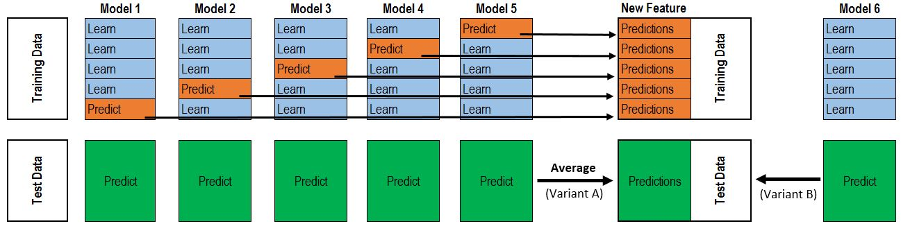

### 在这个方法中我们使用 stacking model 的方法进行预测
#### 首先将我们所使用到的模型的预测结果进行输出，将这些预测结果进行整合，并作为输入，加入到最后的meta-model中作为输出，用这些整合后的结果用来作为新的输出结果

实际过程如下图所示：

* In this approach, we add a meta-model on averaged base models and use the out-of-folds predictions of these base models to train our meta-model.
* The procedure, for the training part, may be described as follows:Split the total training set into two disjoint sets (here train and .holdout )

* Train several base models on the first part (train)

* Test these base models on the second part (holdout)

* Use the predictions from 3) (called out-of-folds predictions) as the inputs, and the correct responses (target variable) as the outputs to train a higher level learner called meta-model.

* The first three steps are done iteratively . If we take for example a 5-fold stacking , we first split the training data into 5 folds. Then we will do 5 iterations. In each iteration, we train every base model on 4 folds and predict on the remaining fold (holdout fold).

* So, we will be sure, after 5 iterations , that the entire data is used to get out-of-folds predictions that we will then use as new feature to train our meta-model in the step 4.

* For the prediction part , We average the predictions of all base models on the test data and used them as meta-features on which, the final prediction is done with the meta-model.
